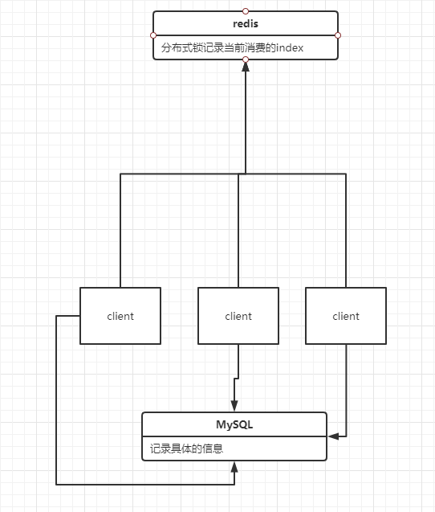
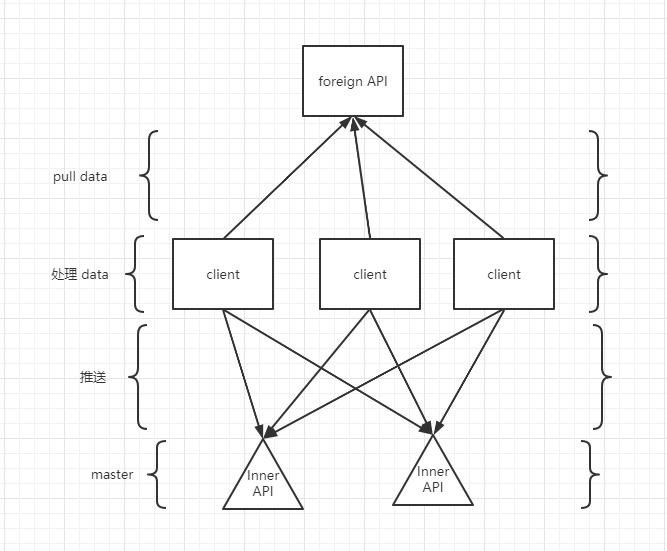

# 偷偷拉bilibili的可以看得见得用户信息

## 板块设计

经过爷不断地修改，数据层已经变成下面的结构了。

调用结构

## 设计想法

**version1.1**

已经完成了上面那些的设计，那么久可以共享数据库以及分布式锁控制下，线程安全不会重复消费的问题。由于加入了分布式锁的架构，可以在任何电脑进行请求。大大地加快了请求速度，我们算下算，3s一次请求，6台设备，那么一天就是17w次请求。比之前块很多，那小小b站拿下指日可待。开玩笑的，我们按照他1亿用户算，那么爬取下所有的信息需要2年时间，这肯定不能忍受啊。所以下一步的想法是进行一次升级，设计出有ip代理的情况。目前ip代理大部分需要钱免费的感觉已经被人用烂了或者屏蔽了。没办法，我测试时候发现在他很不稳定，所以目前只能是测试阶段，只能先把他push到新的分支了。进行单独的部署，这样需要考虑一个问题，系统稳定性，如果放开速度让他去请求，那么久很tm的危险，0.1s一次请求，多了也容易把他冲烂，为了保证数据被重复消费，对于这种不稳定的请求需要进行一个隔离区，比如我把数据100个数据前79设置谁都可以消费，后30个设置为保留位。

**version1.2**

加上一个中心注册系统，这个系统最大的问题是虽然有主服务器，但是没有一个控制中心，我想对一些数据进行控制就很难，这个估计需要花一段时间处理，目前理想是使用zookeeper作为注册中心。